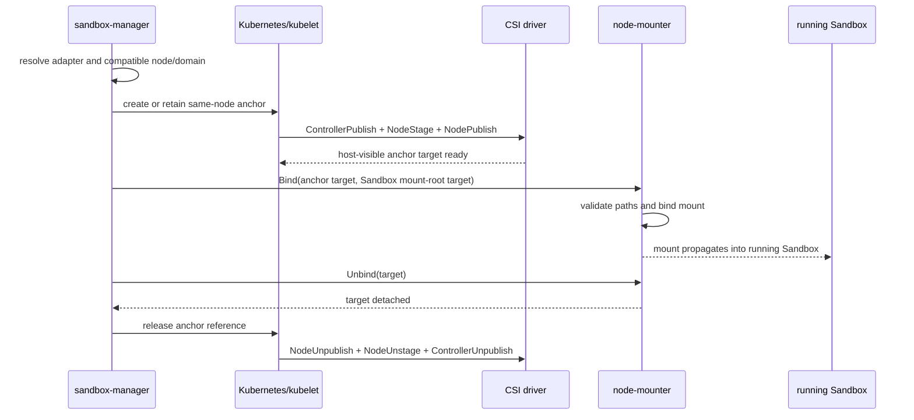

# Staged CSI Lifecycle Adapters for Dynamic Sandbox Mounts

## Summary

The current dynamic CSI implementation assumes that a running Sandbox can call
`NodePublishVolume` directly through a CSI node-plugin socket. That is sufficient for the Alibaba
Cloud NAS and OSS drivers used by the original implementation, but it is not a complete CSI
lifecycle implementation. Drivers such as Volcano Engine VEPFS require Kubernetes to complete
`ControllerPublishVolume` and `NodeStageVolume` before `NodePublishVolume`; the stage step also
creates driver-private metadata consumed by publish. VEPFS additionally assigns each node to a
single mount-service domain.

This proposal adds a capability-based CSI lifecycle adapter layer. Direct-publish drivers retain
the existing wire contract and execution path. Staged drivers use a Kubernetes-managed anchor
volume on the selected node, followed by a privileged node mounter whose target mount is
`Bidirectional`. The already-running, non-privileged Sandbox receives those host mount events through
a `HostToContainer` mount-root. Each `Sandbox UID + VolumeIdentity` owns a distinct Anchor Pod;
unmount reverses that order and releases only that Sandbox's anchor.

VEPFS is the first staged adapter. The abstraction is intentionally based on lifecycle and placement
capabilities rather than cloud names so that Volcano Engine EFS/FSx, Tencent storage, and other CSI
drivers can reuse either the direct-publish or staged-anchor strategy.

## Motivation

Pre-warmed Sandboxes are already running when a Claim provides its storage requirements. Their Pod
specification cannot be mutated to add a new CSI volume. Calling a node plugin from inside the
Sandbox solves this only when the driver implements publish as a self-contained mount operation.
It does not synthesize the controller and stage phases required by other drivers.

### Evidence from `vke-openkruise-test`

The following observations were reproduced on the Volcano Engine test cluster on 2026-08-14:

1. `vepfs.csi.volcengine.com` is registered on regular VKE nodes and its `CSIDriver` declares
   `attachRequired: true`. It is not registered on the tested VCI nodes.
2. A direct agent-shaped `NodePublishVolume` call failed with
   `load volume mount info: open info.json: no such file or directory`.
3. A normal Kubernetes VEPFS Pod succeeded only after the driver log showed the sequence
   `Stage volume`, creation of `<staging-target>/info.json`, and then `Publish volume`.
4. The tested VEPFS PV carries `fsid`, `mountServiceID`, `volumeHandle`, controller-publish Secret,
   and node-stage Secret information. A bare `NodePublishVolumeRequest` is therefore not sufficient
   to reconstruct its lifecycle safely.
5. A node already joined to mount service `mount-aed6284f` rejected a volume from
   `mount-3dccb7d6` with an error stating that the node had already joined a different domain.
6. A positive experiment proved the desired pre-warm behavior: after a business Pod was already
   running, a same-node Kubernetes anchor caused kubelet to Attach/Stage/Publish VEPFS; a privileged
   mounter then bind-mounted the host-visible kubelet target into the shared `emptyDir`. The
   privileged mounter side was `Bidirectional`; the non-privileged business container side was
   `HostToContainer`. The original business Pod read and wrote VEPFS without restarting. Reversing
   the bind mount removed it without restarting the Pod.
7. A server-side dry-run proved that Kubernetes rejects `Bidirectional` on the existing
   non-privileged Sandbox business container. The business container does not need that direction:
   it only needs host-to-container mount and unmount events.

These observations close the causal chain:

```text
VEPFS NodePublish reads stage metadata
  -> direct agent call has no NodeStage and no info.json
  -> direct call fails regardless of provider field mapping
  -> Kubernetes anchor supplies Attach + Stage + Publish
  -> same-node privileged bind supplies the mount to the running warm Sandbox
  -> mounter Bidirectional + Sandbox HostToContainer propagation makes it visible in the Sandbox
```

### Goals

- Dynamically mount and unmount VEPFS in an already-running, pre-warmed Sandbox without restarting
  or replacing the Sandbox Pod.
- Preserve the existing base64-encoded `NodePublishVolumeRequest` contract for current direct CSI
  providers.
- Model driver lifecycle and node-placement requirements explicitly.
- Enforce VEPFS mount-service domain compatibility before choosing a warm Sandbox.
- Make mount and unmount idempotent, retryable, and reconcilable after process or node failures.
- Provide extension seams for EFS/FSx and Tencent CSI drivers without adding vendor conditionals to
  Claim handling or the storage CLI.

### Non-Goals

- Modifying the VEPFS CSI driver.
- Making a node participate in multiple VEPFS mount-service domains when the vendor driver forbids
  it.
- Supporting VEPFS on VCI nodes where the CSI node plugin is not registered.
- Calling raw `ControllerPublishVolume` or `NodeStageVolume` from agent-runtime. Kubernetes remains
  the lifecycle owner for staged drivers.

## Design

### Capability model

Each registered driver adapter resolves a PV and a `CSIMountConfig` into a neutral lifecycle plan:

```go
type Strategy string

const (
    StrategyDirectNodePublish Strategy = "DirectNodePublish"
    StrategyKubeletAnchor     Strategy = "KubeletAnchor"
)

type LifecyclePlan struct {
    Driver          string
    Strategy        Strategy
    VolumeIdentity  string
    MountPath       string
    ReadOnly        bool
    Placement       PlacementRequirement
    PublishRequest  *csi.NodePublishVolumeRequest // direct strategy only
    Anchor          *AnchorSpec                    // anchor strategy only
}

type PlacementRequirement struct {
    RequiresCSINode bool
    DomainKey       string
    DomainValue     string
}
```

The public adapter surface is deliberately narrow:

```go
type LifecycleAdapter interface {
    Driver() string
    Resolve(ctx context.Context, input ResolveInput) (LifecyclePlan, error)
}
```

Execution is owned by one lifecycle service with three operations: `Mount`, `Unmount`, and
`Reconcile`. Callers do not know whether the resulting plan uses a direct CSI RPC or an anchor.
For the staged strategy, sandbox-manager creates a privileged Anchor Pod pinned to the Sandbox
node. The mounter runs inside that Pod; there is no remotely reachable privileged mount API.

This split avoids two leaky abstractions:

- Provider code understands driver-specific PV and Secret fields but not Claim orchestration.
- Claim orchestration understands placement results but not CSI RPC ordering or host paths.

### Strategies

#### Direct NodePublish

Alibaba NAS and OSS keep the existing behavior:

1. Resolve PV and Secret into `NodePublishVolumeRequest`.
2. Send the existing encoded request to agent-runtime.
3. agent-runtime calls `NodePublishVolume` using the local CSI socket.
4. Unmount calls `NodeUnpublishVolume` and safely removes the owned symlink and empty target.

This is backward compatible and requires no new sidecar.

#### Kubelet anchor

VEPFS and other staged drivers use this sequence:



The anchor is an agent-owned Kubernetes Pod pinned to the same node as the Sandbox. Its Pod
spec contains the real PV reference, so kubelet and external CSI components remain responsible for
all attach, stage, publish, secret, and recovery behavior. The anchor's published kubelet path must
be host-visible to the node mounter. The node mounter performs only a bind/unbind into an allowlisted
Sandbox mount-root. The privileged mounter uses `Bidirectional`; the unprivileged Sandbox uses
`HostToContainer`. The Anchor Pod is also the persisted operation record: labels and annotations
carry the Sandbox UID, Sandbox Pod UID, volume identity, PV and target path, while a finalizer keeps
the Pod observable until the mounter reports a successful unmount.

### VEPFS adapter

The VEPFS adapter:

- recognizes `vepfs.csi.volcengine.com`;
- validates `fsid`, `mountServiceID`, and `volumeHandle` from the PV;
- validates the PV access mode and preserves requested read-only semantics;
- preserves controller-publish and node-stage Secret references on the anchor PV/Pod path instead
  of flattening all credentials into a publish request;
- emits `StrategyKubeletAnchor` and placement domain
  `vepfs.csi.volcengine.com/mount-service=<mountServiceID>`;
- never calls VEPFS `NodePublishVolume` directly from the Sandbox CLI.

`mountServiceID` is not merely a request attribute. In the tested driver it selects a GPFS/VEPFS
cluster domain, and joining one changes node-level state shared by all Pods. Therefore a warm
Sandbox is eligible only if its node is already assigned to the same domain or is unassigned and
can be reserved for it.

### Domain-aware placement

The Claim path filters warm candidates before taking the Claim lock:

1. Remove nodes without a matching `CSINode` driver registration.
2. Require the node's operator-managed domain label to equal the PV's `mountServiceID`.
3. Never claim a warm Sandbox on a different or unlabelled domain.
4. For the cold-create fallback, materialize the resolved SandboxTemplate and inject the same domain
   label as a `nodeSelector`; reject an existing conflicting selector before creating anything.
5. If no warm Sandbox is compatible, return the existing no-capacity result or take the constrained
   cold-start fallback.

The current rollout deliberately does not reassign node domains dynamically. Operations labels only
nodes whose live VEPFS client and current boot ID prove they already belong to that mount service.
This matches the test environment's one-to-one mountServiceID policy and avoids treating Anchor
deletion as evidence that vendor node-global state is clean. Dynamic domain assignment would need a
separate node lease plus a vendor-supported leave/reset operation.

### Identity, ownership, and concurrency

`VolumeIdentity` is stable across retries and is derived from driver, PV UID/volume handle,
sub-path, read-only flag, and the Sandbox mount target. It must not contain a random suffix.

`VolumeIdentity` identifies the sandbox-local target, while the Anchor Pod name hashes
`Sandbox UID + VolumeIdentity`. This prevents two Sandboxes concurrently using the same RWX PV from
colliding and still gives retries for one Sandbox the same object.

Create is idempotent: an existing Anchor is accepted only when its identity, Sandbox UID, Sandbox
Pod UID, target and node match. Delete first sends SIGTERM; the mounter retries a normal unmount and
must exit zero. Only then does manager remove the owned sandbox symlink and finalizer. Partial Claim
failures roll back all Anchors for that Sandbox. A 30-second reconciler continues interrupted
finalizer transitions and deletes Anchors whose Sandbox disappeared, returned to the pool, or moved
to a new Pod UID.

### Node mounter contract

The node mounter is a static binary inside the Anchor Pod. It has no network listener. Its arguments
contain only the fixed in-container source and a SHA-256 identity below the fixed target root. It:

- runs only on the Sandbox node selected in the Pod spec;
- receives the source only through a kubelet-managed PVC mount;
- rejects sources outside `/source` and targets outside `/target/anchor`;
- reaches only the exact Sandbox emptyDir host path derived from the Kubernetes-reported Pod UID;
- uses bind mount followed by read-only remount when required;
- verifies `/proc/self/mountinfo` after mount and unmount;
- makes repeat mount/unmount calls return the already-achieved result;
- never uses lazy/forced unmount by default;
- never receives or logs CSI Secrets.

This remains an `agent_dp` change: the new privileged component is agent-owned and ephemeral, and
does not require a VEPFS driver modification.

## Compatibility and rollout

- Existing `CSIMountConfig` and encoded `NodePublishVolumeRequest` consumers remain unchanged.
- The lifecycle resolver is enabled only for registered staged adapters.
- VEPFS support is gated by the staged-driver allowlist, the Anchor image setting, CSINode
  registration and operator-managed domain labels. A missing Anchor image fails before Pod creation.
- Rollout starts on a dedicated VEPFS-domain node pool in `vke-openkruise-test`.
- Downgrade must first drain staged mounts, then remove anchors and node mounters. Direct providers
  remain usable throughout.

## Risks and mitigations

| Risk | Consequence | Mitigation |
|---|---|---|
| Wrong domain placement | VEPFS mount fails; node state may be polluted | Pre-claim filtering, cold-create nodeSelector, static operator-owned domain label |
| VCI scheduling | Driver socket/CSINode absent | Require regular VKE node and verify `CSINode` registration |
| Anchor ready but expose fails | Leaked CSI attachment | Roll back the Anchor before failing Claim; reconciler reaps abandoned Pods |
| Anchor deleted before unbind | Stale/busy bind mount | Pod finalizer; mounter must exit zero before symlink cleanup/finalizer removal |
| Controller crash during transition | Duplicate or leaked operations | Stable names, Anchor annotations/finalizer and periodic reconciliation |
| Mount propagation misconfigured | Host bind is invisible in Sandbox | Admission validation for shared mount-root, privileged `Bidirectional` mounter, and unprivileged `HostToContainer` Sandbox; E2E assertion |
| Host-path traversal | Node compromise or cross-tenant access | Kubernetes Pod UID-derived host path, fixed `/source` and `/target/anchor` roots, SHA-256 identity |
| Busy unmount | Data corruption or leak | Return retryable error, preserve symlink/state, reconcile; no forced unmount by default |
| Credential rotation | Remount fails with expired credentials | Keep Secrets in Kubernetes CSI lifecycle; recreate/reconcile anchor using current Secret |
| Domain appears free after last anchor | Cross-domain join conflict | Never clear/reassign the static domain label as part of Anchor cleanup |
| Random volume identity | Unmount cannot find the mounted target | Stable identity used by both mount and unmount |
| Sandbox pause/resume | Anchor points to an obsolete Pod emptyDir | Reconciler removes old-Pod Anchors; automatic staged remount on resume is not yet supported |

## Alternatives considered

### Call VEPFS NodeStage directly from agent-runtime

Rejected. Stage has node-global paths and state, requires NodePublish/NodeUnstage ordering and
credential handling, and overlaps kubelet's CSI operation ownership. It would create two independent
orchestrators for one driver on the same node.

### Treat VEPFS as another direct provider

Rejected by the cluster experiment: publish reads `info.json` produced by stage. Adding more
`VolumeContext` fields cannot manufacture the driver-private stage state.

### Add vendor branches to Claim and CLI code

Rejected. It couples orchestration to cloud names and still does not model lifecycle or placement.
The adapter selects a capability strategy; strategy execution remains generic.

### Recreate the pre-warmed Sandbox Pod with a VEPFS volume

Functionally valid but defeats the pre-warm requirement and changes Sandbox identity/restart
semantics. It remains a cold-start fallback when no compatible warm node exists.

## Test plan

### Unit and contract tests

1. **Lifecycle resolver seam:** PV + Secret + `CSIMountConfig` produces the expected strategy,
   stable identity, domain requirement, and anchor specification. Provider validation must not
   mutate the source request or Kubernetes objects.
2. **Placement seam:** candidate Sandboxes on same-domain, free, wrong-domain, VCI, and
   driver-missing nodes produce deterministic eligibility decisions before Claim mutation.
3. **Node mounter seam:** the static binary verifies idempotent mount/unmount, fixed-root path
   rejection, read-only remount, readiness and signal-driven cleanup.
4. **Storage CLI seam:** direct providers issue NodePublish/NodeUnpublish, calculate the same target
   identity, preserve paths on failure, and delete only owned links/directories.

### `vke-openkruise-test` integration tests

1. Deploy the Anchor image and inject the shared mount-root with privileged Anchor
   `Bidirectional` and unprivileged Sandbox `HostToContainer` propagation.
2. Claim an already-running warm Sandbox with no VEPFS in its original Pod spec.
3. Dynamically mount a VEPFS PV and verify filesystem type, read/write, unchanged Pod UID, and zero
   container restart count.
4. Explicitly unmount and verify disappearance inside the Sandbox, CSI unpublish completion, and no
   stale host mount.
5. Repeat mount/unmount to prove idempotency.
6. Restart sandbox-manager during `Binding` and during `Unbinding`; verify reconciliation.
7. Claim the same-domain RWX volume on a second warm Sandbox; verify distinct per-Sandbox Anchors
   and no name/ownership collision.
8. Try a different `mountServiceID` on the occupied node; verify rejection before Claim.
9. Try a VCI node and a node without the VEPFS `CSINode`; verify rejection before Claim.
10. Hibernate/resume and verify the old-Pod Anchor is cleaned; staged mount restoration is expected
    to fail explicitly until resume orchestration is implemented.

Evidence collected for each test includes Sandbox/anchor UIDs, node, mount-service ID, CSI event
sequence, `/proc/self/mountinfo`, read/write marker, restart count, mount records, and cleanup state.

## Implementation phases

- **Phase 1:** complete symmetric direct-provider unmount and safe path cleanup.
- **Phase 2:** add lifecycle plan/adapter registry and VEPFS resolver with unit tests.
- **Phase 3:** add domain-aware warm filtering and cold-create nodeSelector using static
  operator-owned node domain labels.
- **Phase 4:** implement the isolated privileged Anchor mounter, finalizer cleanup and orphan
  reconciliation.
- **Phase 5:** deploy and run the `vke-openkruise-test` matrix above.
- **Phase 6:** extract reusable adapter conformance tests and add EFS/FSx or Tencent drivers as their
  exact CSI lifecycle requirements become available.

## Implementation history

- [x] 2026-08-14: Reproduced VEPFS direct-publish failure and anchor/bind success in
  `vke-openkruise-test`.
- [x] 2026-08-14: Implemented Phase 1 on `feat/vepfs-csi-lifecycle-adapter`.
- [x] 2026-08-14: Implemented Phase 2 lifecycle plan, capability-based registry selection, VEPFS
  resolver, stable CSI volume identity, and direct-publish rejection tests.
- [x] 2026-08-14: Implemented Phases 3 and 4, including cold-create placement, cross-Sandbox Anchor
  identity, partial-failure rollback, synchronous unmount and restart/orphan reconciliation.
- [ ] Phase 5 cluster deployment/E2E and Phase 6 multi-provider conformance extraction.
