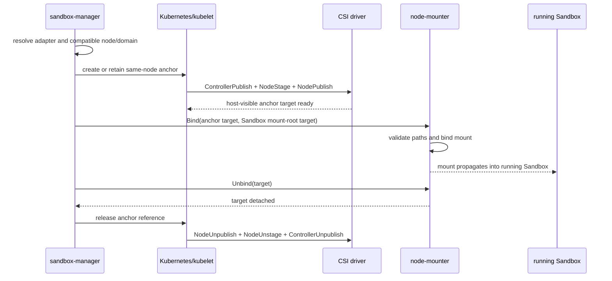

# Staged CSI Lifecycle Adapters for Dynamic Sandbox Mounts

## Summary

The current dynamic CSI implementation assumes that a running Sandbox can call
`NodePublishVolume` directly through a CSI node-plugin socket. That is sufficient for the Alibaba
Cloud NAS and OSS drivers used by the original implementation, but it is not a complete CSI
lifecycle implementation. Drivers such as Volcano Engine VEPFS require Kubernetes to complete
`ControllerPublishVolume` and `NodeStageVolume` before `NodePublishVolume`; the stage step also
creates driver-private metadata consumed by publish. VEPFS additionally assigns each node to a
single mount-service domain.

This proposal adds a capability-based CSI lifecycle adapter layer. Direct-publish drivers retain
the existing wire contract and execution path. Staged drivers use a Kubernetes-managed anchor
volume on the selected node, followed by a privileged node mounter that bind-mounts the
kubelet-published anchor target into the already-running Sandbox mount namespace with bidirectional
mount propagation. Unmount reverses that order and releases the anchor only after the last consumer.

VEPFS is the first staged adapter. The abstraction is intentionally based on lifecycle and placement
capabilities rather than cloud names so that Volcano Engine EFS/FSx, Tencent storage, and other CSI
drivers can reuse either the direct-publish or staged-anchor strategy.

## Motivation

Pre-warmed Sandboxes are already running when a Claim provides its storage requirements. Their Pod
specification cannot be mutated to add a new CSI volume. Calling a node plugin from inside the
Sandbox solves this only when the driver implements publish as a self-contained mount operation.
It does not synthesize the controller and stage phases required by other drivers.

### Evidence from `vke-openkruise-test`

The following observations were reproduced on the Volcano Engine test cluster on 2026-08-14:

1. `vepfs.csi.volcengine.com` is registered on regular VKE nodes and its `CSIDriver` declares
   `attachRequired: true`. It is not registered on the tested VCI nodes.
2. A direct agent-shaped `NodePublishVolume` call failed with
   `load volume mount info: open info.json: no such file or directory`.
3. A normal Kubernetes VEPFS Pod succeeded only after the driver log showed the sequence
   `Stage volume`, creation of `<staging-target>/info.json`, and then `Publish volume`.
4. The tested VEPFS PV carries `fsid`, `mountServiceID`, `volumeHandle`, controller-publish Secret,
   and node-stage Secret information. A bare `NodePublishVolumeRequest` is therefore not sufficient
   to reconstruct its lifecycle safely.
5. A node already joined to mount service `mount-aed6284f` rejected a volume from
   `mount-3dccb7d6` with an error stating that the node had already joined a different domain.
6. A positive experiment proved the desired pre-warm behavior: after a business Pod was already
   running, a same-node Kubernetes anchor caused kubelet to Attach/Stage/Publish VEPFS; a privileged
   mounter then bind-mounted the host-visible kubelet target into a bidirectionally propagated
   `emptyDir`. The original business Pod read and wrote VEPFS without restarting. Reversing the bind
   mount removed it without restarting the Pod.

These observations close the causal chain:

```text
VEPFS NodePublish reads stage metadata
  -> direct agent call has no NodeStage and no info.json
  -> direct call fails regardless of provider field mapping
  -> Kubernetes anchor supplies Attach + Stage + Publish
  -> same-node privileged bind supplies the mount to the running warm Sandbox
  -> bidirectional propagation makes it visible in the Sandbox mount namespace
```

### Goals

- Dynamically mount and unmount VEPFS in an already-running, pre-warmed Sandbox without restarting
  or replacing the Sandbox Pod.
- Preserve the existing base64-encoded `NodePublishVolumeRequest` contract for current direct CSI
  providers.
- Model driver lifecycle and node-placement requirements explicitly.
- Enforce VEPFS mount-service domain compatibility before choosing a warm Sandbox.
- Make mount and unmount idempotent, retryable, and reconcilable after process or node failures.
- Provide extension seams for EFS/FSx and Tencent CSI drivers without adding vendor conditionals to
  Claim handling or the storage CLI.

### Non-Goals

- Modifying the VEPFS CSI driver.
- Making a node participate in multiple VEPFS mount-service domains when the vendor driver forbids
  it.
- Supporting VEPFS on VCI nodes where the CSI node plugin is not registered.
- Calling raw `ControllerPublishVolume` or `NodeStageVolume` from agent-runtime. Kubernetes remains
  the lifecycle owner for staged drivers.

## Design

### Capability model

Each registered driver adapter resolves a PV and a `CSIMountConfig` into a neutral lifecycle plan:

```go
type Strategy string

const (
    StrategyDirectNodePublish Strategy = "DirectNodePublish"
    StrategyKubeletAnchor     Strategy = "KubeletAnchor"
)

type LifecyclePlan struct {
    Driver          string
    Strategy        Strategy
    VolumeIdentity  string
    MountPath       string
    ReadOnly        bool
    Placement       PlacementRequirement
    PublishRequest  *csi.NodePublishVolumeRequest // direct strategy only
    Anchor          *AnchorSpec                    // anchor strategy only
}

type PlacementRequirement struct {
    RequiresCSINode bool
    DomainKey       string
    DomainValue     string
}
```

The public adapter surface is deliberately narrow:

```go
type LifecycleAdapter interface {
    Driver() string
    Resolve(ctx context.Context, input ResolveInput) (LifecyclePlan, error)
}
```

Execution is owned by one lifecycle service with three operations: `Mount`, `Unmount`, and
`Reconcile`. Callers do not know whether the resulting plan uses a direct CSI RPC or an anchor.
The service delegates staged data-plane operations through a `NodeMounter` port implemented by the
privileged node component.

This split avoids two leaky abstractions:

- Provider code understands driver-specific PV and Secret fields but not Claim orchestration.
- Claim orchestration understands placement results but not CSI RPC ordering or host paths.

### Strategies

#### Direct NodePublish

Alibaba NAS and OSS keep the existing behavior:

1. Resolve PV and Secret into `NodePublishVolumeRequest`.
2. Send the existing encoded request to agent-runtime.
3. agent-runtime calls `NodePublishVolume` using the local CSI socket.
4. Unmount calls `NodeUnpublishVolume` and safely removes the owned symlink and empty target.

This is backward compatible and requires no new sidecar.

#### Kubelet anchor

VEPFS and other staged drivers use this sequence:



The anchor is an agent-owned Kubernetes workload pinned to the same node as the Sandbox. Its Pod
spec contains the real PV reference, so kubelet and external CSI components remain responsible for
all attach, stage, publish, secret, and recovery behavior. The anchor's published kubelet path must
be host-visible to the node mounter. The node mounter performs only a bind/unbind into an allowlisted
Sandbox mount-root with `Bidirectional` propagation.

### VEPFS adapter

The VEPFS adapter:

- recognizes `vepfs.csi.volcengine.com`;
- validates `fsid`, `mountServiceID`, and `volumeHandle` from the PV;
- validates the PV access mode and preserves requested read-only semantics;
- preserves controller-publish and node-stage Secret references on the anchor PV/Pod path instead
  of flattening all credentials into a publish request;
- emits `StrategyKubeletAnchor` and placement domain
  `vepfs.csi.volcengine.com/mount-service=<mountServiceID>`;
- never calls VEPFS `NodePublishVolume` directly from the Sandbox CLI.

`mountServiceID` is not merely a request attribute. In the tested driver it selects a GPFS/VEPFS
cluster domain, and joining one changes node-level state shared by all Pods. Therefore a warm
Sandbox is eligible only if its node is already assigned to the same domain or is unassigned and
can be reserved for it.

### Domain-aware placement

The Claim path must filter warm candidates before taking the Claim lock:

1. Remove nodes without a matching `CSINode` driver registration.
2. Prefer nodes already assigned to the requested domain.
3. Otherwise reserve an unassigned compatible node atomically for that domain.
4. Never place a different domain on an assigned node.
5. If no warm Sandbox is compatible, return a typed capacity/placement failure or take the existing
   cold-start fallback; do not claim an incompatible Sandbox and fail later during mount.

The assignment is recorded in an agent-owned node-scoped lease/resource, not inferred solely from
currently running anchors. A mount-service may leave persistent node state after the last Pod, so
deleting the anchor is not evidence that the node is immediately reusable by another domain. The
lease is released only after a driver-defined cleanup or explicit node recycling policy confirms
that reuse is safe.

### Identity, ownership, and concurrency

`VolumeIdentity` is stable across retries and is derived from driver, PV UID/volume handle,
sub-path, read-only flag, and the Sandbox mount target. It must not contain a random suffix.

The control plane stores an agent-owned mount record with these states:

```text
Pending -> Anchoring -> Ready -> Binding -> Mounted
   |          |                    |          |
   +----------+------> Failed <----+----------+
Mounted -> Unbinding -> Releasing -> Released
```

Each transition is idempotent. At most one operation for a `VolumeIdentity + Sandbox UID` executes
at a time. An anchor is reference-counted by node and physical volume identity; it is deleted only
when its last consumer has successfully unbound. Reconciliation handles abandoned `Binding`,
`Unbinding`, and `Releasing` states after controller restarts.

### Node mounter contract

The node mounter exposes idempotent `Mount`, `Unmount`, and `Inspect` operations. Requests contain
opaque mount identity plus resolved source and target identifiers; the server resolves and verifies
actual host paths. It must:

- run only on the requested node;
- authenticate and authorize sandbox-manager requests;
- reject sources outside known kubelet CSI publish roots;
- reject targets outside the agent-owned mount-root for the target Sandbox UID;
- resolve symlinks before applying allowlist checks;
- use bind mount followed by read-only remount when required;
- verify `/proc/self/mountinfo` after mount and unmount;
- make repeat mount/unmount calls return the already-achieved result;
- use lazy/forced unmount only through an explicit recovery policy, never as the default;
- never log CSI Secrets.

The production implementation may be a DaemonSet or a privileged sidecar colocated on eligible
nodes. This is still an `agent_dp` change: it introduces an agent-owned data-plane component and does
not require a VEPFS driver modification.

## Compatibility and rollout

- Existing `CSIMountConfig` and encoded `NodePublishVolumeRequest` consumers remain unchanged.
- The lifecycle resolver is enabled only for registered staged adapters.
- VEPFS support is gated by deployment configuration listing eligible node pools and the node
  mounter endpoint. A missing node mounter fails resolution before a Sandbox is claimed.
- Rollout starts on a dedicated VEPFS-domain node pool in `vke-openkruise-test`.
- Downgrade must first drain staged mounts, then remove anchors and node mounters. Direct providers
  remain usable throughout.

## Risks and mitigations

| Risk | Consequence | Mitigation |
|---|---|---|
| Wrong domain placement | VEPFS mount fails; node state may be polluted | Pre-claim domain filtering plus atomic node lease |
| VCI scheduling | Driver socket/CSINode absent | Require regular VKE node and verify `CSINode` registration |
| Anchor ready but bind fails | Leaked CSI attachment | Persist state and reconcile; retain anchor until bind cleanup completes |
| Anchor deleted before unbind | Stale/busy bind mount | Strict unbind-before-release state machine and reference count |
| Controller crash during transition | Duplicate or leaked operations | Stable identity, idempotent APIs, persisted phases, reconciliation |
| Mount propagation misconfigured | Host bind is invisible in Sandbox | Admission validation for shared mount-root and `Bidirectional` propagation; E2E assertion |
| Host-path traversal | Node compromise or cross-tenant access | Server-side UID/path resolution, symlink resolution, fixed allowlists, authentication |
| Busy unmount | Data corruption or leak | Return retryable error, preserve symlink/state, reconcile; no forced unmount by default |
| Credential rotation | Remount fails with expired credentials | Keep Secrets in Kubernetes CSI lifecycle; recreate/reconcile anchor using current Secret |
| Domain appears free after last anchor | Cross-domain join conflict | Persistent domain lease; release only after verified cleanup or node recycling |
| Random volume identity | Unmount cannot find the mounted target | Stable identity used by both mount and unmount |

## Alternatives considered

### Call VEPFS NodeStage directly from agent-runtime

Rejected. Stage has node-global paths and state, requires NodePublish/NodeUnstage ordering and
credential handling, and overlaps kubelet's CSI operation ownership. It would create two independent
orchestrators for one driver on the same node.

### Treat VEPFS as another direct provider

Rejected by the cluster experiment: publish reads `info.json` produced by stage. Adding more
`VolumeContext` fields cannot manufacture the driver-private stage state.

### Add vendor branches to Claim and CLI code

Rejected. It couples orchestration to cloud names and still does not model lifecycle or placement.
The adapter selects a capability strategy; strategy execution remains generic.

### Recreate the pre-warmed Sandbox Pod with a VEPFS volume

Functionally valid but defeats the pre-warm requirement and changes Sandbox identity/restart
semantics. It remains a cold-start fallback when no compatible warm node exists.

## Test plan

### Unit and contract tests

1. **Lifecycle resolver seam:** PV + Secret + `CSIMountConfig` produces the expected strategy,
   stable identity, domain requirement, and anchor specification. Provider validation must not
   mutate the source request or Kubernetes objects.
2. **Placement seam:** candidate Sandboxes on same-domain, free, wrong-domain, VCI, and
   driver-missing nodes produce deterministic eligibility decisions before Claim mutation.
3. **Node mounter seam:** an in-memory contract adapter verifies idempotent mount/unmount ordering,
   reference counting, path rejection, and recovery state transitions.
4. **Storage CLI seam:** direct providers issue NodePublish/NodeUnpublish, calculate the same target
   identity, preserve paths on failure, and delete only owned links/directories.

### `vke-openkruise-test` integration tests

1. Deploy the node mounter to a dedicated regular-node pool with bidirectional propagation.
2. Claim an already-running warm Sandbox with no VEPFS in its original Pod spec.
3. Dynamically mount a VEPFS PV and verify filesystem type, read/write, unchanged Pod UID, and zero
   container restart count.
4. Explicitly unmount and verify disappearance inside the Sandbox, CSI unpublish completion, and no
   stale host mount.
5. Repeat mount/unmount to prove idempotency.
6. Restart sandbox-manager during `Binding` and during `Unbinding`; verify reconciliation.
7. Claim the same-domain volume on a second warm Sandbox on the same node; verify anchor reuse and
   reference counting.
8. Try a different `mountServiceID` on the occupied node; verify rejection before Claim.
9. Try a VCI node and a node without the VEPFS `CSINode`; verify rejection before Claim.
10. Hibernate/resume or recreate the Sandbox and verify the persisted mount intent is restored on a
    compatible node.

Evidence collected for each test includes Sandbox/anchor UIDs, node, mount-service ID, CSI event
sequence, `/proc/self/mountinfo`, read/write marker, restart count, mount records, and cleanup state.

## Implementation phases

- **Phase 1:** complete symmetric direct-provider unmount and safe path cleanup.
- **Phase 2:** add lifecycle plan/adapter registry and VEPFS resolver with unit tests.
- **Phase 3:** add domain-aware candidate filtering and persistent node-domain reservation.
- **Phase 4:** implement authenticated node mounter plus anchor/reference reconciliation.
- **Phase 5:** deploy and run the `vke-openkruise-test` matrix above.
- **Phase 6:** extract reusable adapter conformance tests and add EFS/FSx or Tencent drivers as their
  exact CSI lifecycle requirements become available.

## Implementation history

- [x] 2026-08-14: Reproduced VEPFS direct-publish failure and anchor/bind success in
  `vke-openkruise-test`.
- [x] 2026-08-14: Implemented Phase 1 on `feat/vepfs-csi-lifecycle-adapter`.
- [x] 2026-08-14: Implemented Phase 2 lifecycle plan, capability-based registry selection, VEPFS
  resolver, stable CSI volume identity, and direct-publish rejection tests.
- [ ] Phase 3 through Phase 6.
